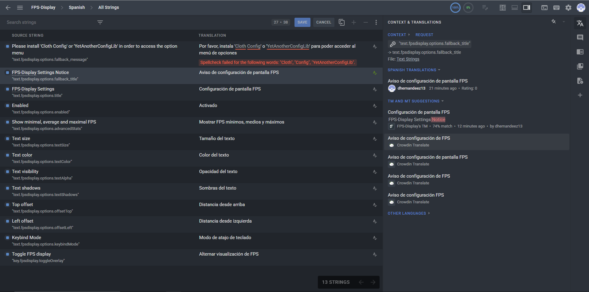

# 🌐 Project: FPS-Display Minecraft mod

**Platform:** Crowdin  
**Translation:** English → Spanish  
**Status:** Completed  
**Content Type:** Interface, documentation, error messages  
**Date:** June 2025

---

## 📄 Description

This directory contains my contribution to the Spanish translation of the **FPS-Display Minecraft mod** project through [Crowdin](https://crowdin.com/).

Goal:
- To make the software more accessible to Spanish-speaking users.

My contribution included:
- Translating interface components (buttons, menus, alerts).
- Adapting technical language for clarity and consistency.
- Following the project's defined style guides.

---

## 🔗 Links

- 🌐 Project: https://github.com/Grayray75/FPS-Display
- 📘 Crowdin Project: https://crowdin.com/project/fps-display
- 🧾 Proof of Participation: https://crowdin.com/profile/dhernandeez13

---

## 🖼️ Screenshots

|                                   |
|-----------------------------------|
|       

